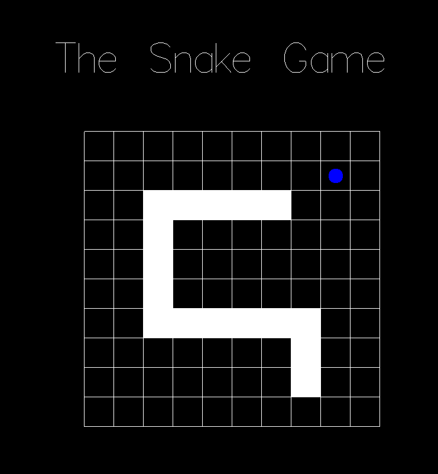

# Snake in Haskell

A Snake Game written in [Haskell](https://www.haskell.org/).

## Setup

Please see the appropriate [guide](https://docs.haskellstack.org/en/stable/README/) for your environment of choice in order to install Stack.

To run this project, start it locally via Stack:

``
stack build --exec SnakeInHaskell
``

## Scope of functionalities

This Game include basic functionalities and gameplay of Snake.

- [x] Basic Controls
- [x] Eating Food
- [x] Food placed 'randomly'
- [x] Game Over Screen
- [x] Retry Functionality 

## Gameplay Screenshot

